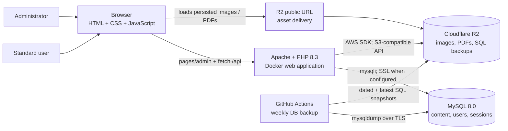
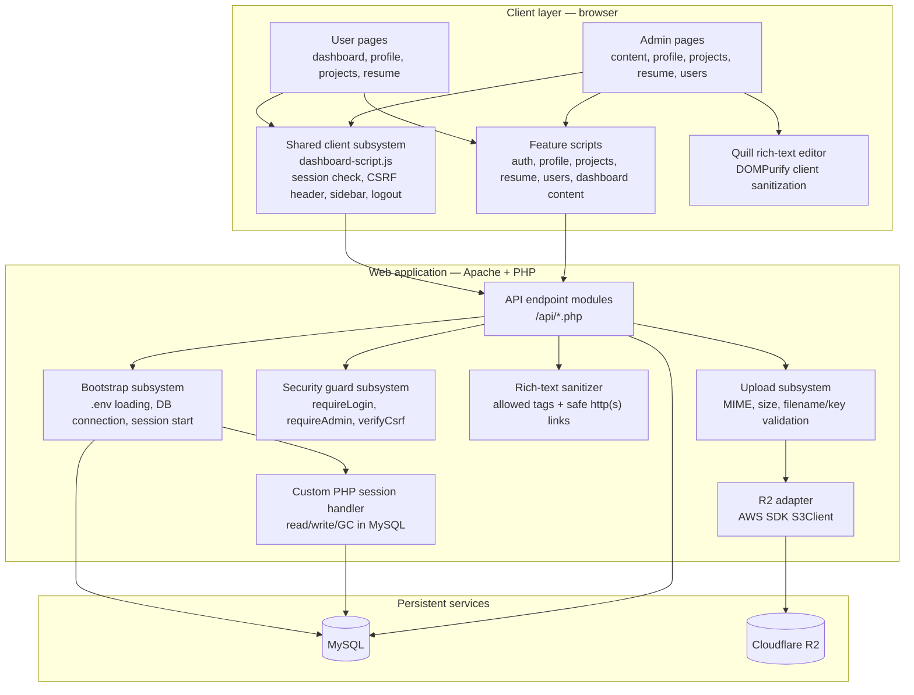
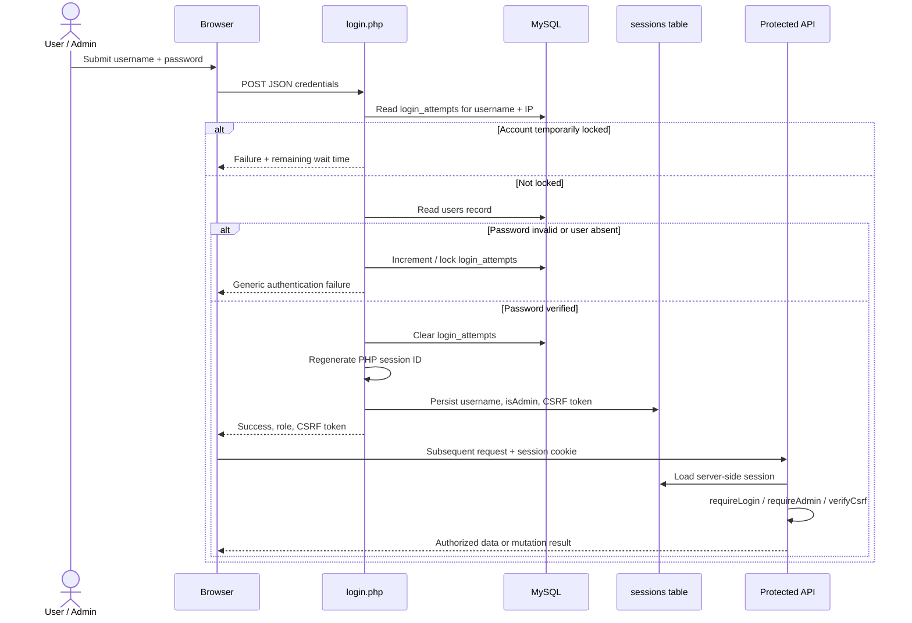
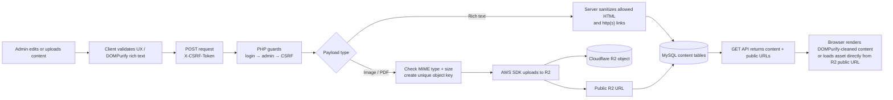
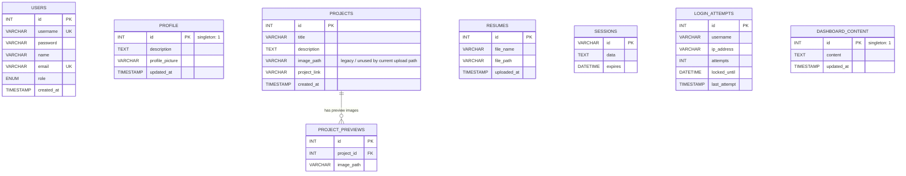
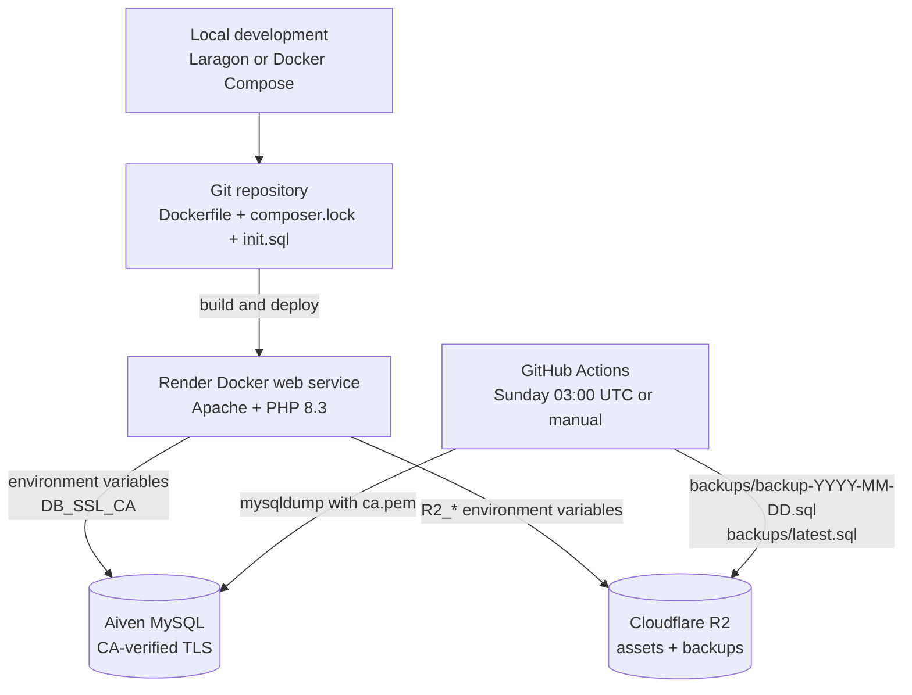

# System Architecture — Portfolio CMS

> A visual, implementation-based map of the PHP portfolio and its CMS. This document describes the system as it exists in this repository.

## 1. System at a glance

The application is a server-rendered static-page frontend with JavaScript-driven API calls. PHP API endpoints enforce authentication and authorization, persist application data and sessions in MySQL, and store uploaded binary assets in Cloudflare R2. The application itself is disposable: persistent state is kept outside the web container.

## 2. Application layers and subsystems

### Client/UI subsystem

- `pages/` is the standard-user experience: dashboard, profile, project gallery, and resume viewer.
- `admin/` provides CMS pages: profile/project/resume uploads, user-role management, and editable dashboard content.
- `assets/scripts/dashboard-script.js` is the cross-cutting browser module. It performs server-side session verification on page load, stores the current CSRF token in `localStorage`, loads the correct sidebar fragment, and handles logout.
- Feature scripts use `fetch()` for JSON and multipart form requests. They also provide loading states, confirmation dialogs, sliders, and image modals.
- Quill is used only when editing rich text. DOMPurify sanitizes that HTML in the browser before it is submitted and again before it is inserted into the DOM.

### API and application subsystem

- Every PHP API endpoint returns JSON and uses `bootstrap.php` directly or through `auth-check.php`.
- `db.php` loads environment variables with `phpdotenv` and creates a `mysqli` connection. If `DB_SSL_CA` is configured, it connects using the CA certificate and MySQL SSL.
- `session-db.php` replaces PHP's default file session storage with a database-backed handler. Session data expires after the configured PHP lifetime (currently 3,600 seconds).
- `auth-check.php` centralizes the three endpoint guards: authenticated session required, admin role required, and matching `X-CSRF-Token` required.
- `r2.php` hides Cloudflare R2 behind four helpers: create S3 client, upload object, extract a key from a public URL, and delete object.

## 3. Authentication and authorization flow

**Authorization rules**

| Capability | Who can use it | Server-side protection |
| --- | --- | --- |
| Sign up and log in | Unauthenticated visitor | Input validation; bcrypt-compatible `password_hash`/`password_verify`; login-attempt throttling |
| View dashboard, profile, projects, and resumes | Authenticated user or admin | `requireLogin()` |
| Edit dashboard content | Admin | `requireAdmin()` + CSRF |
| Upload profile, projects, and resumes | Admin | `requireAdmin()` + CSRF |
| Update project details | Admin | `requireAdmin()` + CSRF |
| Delete a project | Admin | `requireAdmin()` + CSRF |
| List users / change roles | Admin | `requireAdmin()` + CSRF |
| Log out | Authenticated session with valid token | CSRF token validation then session-cookie and server-session destruction |

The browser’s `localStorage` values are used for initial UI routing and carrying the CSRF token, but the API makes the final access decision from the server-side session stored in MySQL.

## 4. Content and upload flows

Upload limits enforced by the server:

| Asset | Accepted type | Maximum size | R2 key prefix | Database record |
| --- | --- | ---: | --- | --- |
| Profile image | JPEG, PNG, WebP | 2 MB | `images/profile/` | `profile.profile_picture` |
| Project image | JPEG, PNG, WebP, GIF | 5 MB each | `images/projects/` | `project_previews.image_path` |
| Resume | PDF | 5 MB | `resumes/` | `resumes.file_path` |

Deleting a project removes its preview rows and attempts to delete each matching R2 object. It also contains a legacy local-upload fallback that only permits deletion inside `assets/uploads`.

## 5. API map

| Endpoint | Purpose | Access | Persistence / integration |
| --- | --- | --- | --- |
| `signup.php` | Create a standard-user account | Public | `users` |
| `login.php` | Authenticate, establish session, issue CSRF token | Public | `users`, `login_attempts`, `sessions` |
| `logout.php` | Destroy current session | Authenticated + CSRF | `sessions` |
| `check-session.php` | Return login/role state and current CSRF token | Session-aware | `sessions` |
| `get-profile.php` | Read profile content | Logged in | `profile` |
| `upload-profile.php` | Save profile text and optional image | Admin + CSRF | `profile`, R2 |
| `get-projects.php` | Read projects with preview images | Logged in | `projects`, `project_previews` |
| `upload-projects.php` | Create project and upload images | Admin + CSRF | `projects`, `project_previews`, R2 |
| `update-project.php` | Update an existing project and replace preview images | Admin + CSRF | `projects`, `project_previews`, R2 |
| `delete-project.php` | Delete project and associated images | Admin + CSRF | `projects`, `project_previews`, R2 |
| `get-resumes.php` | Read uploaded resume metadata | Logged in | `resumes` |
| `upload-resume.php` | Upload resume PDF | Admin + CSRF | `resumes`, R2 |
| `dashboard-content.php` | Read/update dashboard About content | Read: logged in; write: admin + CSRF | `dashboard_content` |
| `users-table.php` | List accounts | Admin + CSRF | `users` |
| `set-role.php` | Change a user role | Admin + CSRF | `users` |

## 6. Database model

`profile` and `dashboard_content` are singleton tables: the application writes and reads row `id = 1`. Sessions are deliberately database records rather than application-container files, allowing a session to survive a container replacement as long as the database remains available.

## 7. Deployment, configuration, and recovery

- **Local Docker:** `docker-compose.yml` starts the app container and a MySQL 8.0 service with `DB_HOST=db`, `DB_USER=appuser`, `DB_PASS=apppassword`, and `DB_NAME=fprojectdb_mysql`. The app source is mounted into `/var/www/html`, `init.sql` seeds the schema at container startup, and MySQL data is persisted in the `db_data` volume.
- **Production:** the Dockerfile builds an Apache + PHP 8.3 web service, installs required PHP extensions and Composer dependencies, enables URL rewriting, and serves the repository content as the application. Render hosts the built container, while MySQL and Cloudflare R2 remain independent managed services.
- **Configuration:** PHP loads environment values via `phpdotenv` in local development, while production and CI inject credentials through environment variables. Database SSL is enabled when `DB_SSL_CA` is provided for CA-verified connections.
- **Recovery subsystem:** `.github/workflows/db-backup.yml` runs `mysqldump` against Aiven using the committed `ca.pem` certificate, then uploads both a dated SQL snapshot and `latest.sql` to Cloudflare R2 via the AWS CLI. The workflow runs weekly and can also be triggered manually.

## 8. Security boundaries and controls

```mermaid
flowchart LR
    Input["Untrusted browser input"] --> Client["Client-side DOMPurify\nUX validation"]
    Client --> API["PHP API boundary"]
    API --> Auth["Session + role checks"]
    Auth --> CSRF["CSRF check on mutations"]
    CSRF --> Validation["Length, MIME, size, method validation"]
    Validation --> Sanitize["Server-side rich-text sanitization"]
    Sanitize --> Data["MySQL / R2"]
    Data --> Output["JSON response / public asset URL"]
    Output --> Render["DOMPurify before HTML render"]
```

Key controls include password hashing, session-ID regeneration after successful login, `HttpOnly`/`SameSite=Lax` session cookies, CSRF tokens on state-changing actions, login throttling (five attempts, 15-minute lock), prepared SQL statements for user-controlled query values, MIME/size checks for uploads, server-side rich-text sanitization, and optional CA-verified encrypted database connections.

## 9. Important operational dependencies

| Dependency | Why it matters |
| --- | --- |
| MySQL availability | Authentication, sessions, all CMS data, and dashboard page protection depend on it. |
| R2 availability | New uploads and project deletion depend on the R2 API; already-stored assets are delivered from the configured public R2 URL. |
| Correct environment variables | Required for DB connection, R2 client credentials, R2 bucket/public URL, and optional SSL CA path. |
| AWS CLI in CI | GitHub Actions uses the AWS CLI to upload backup artifacts to Cloudflare R2. |
| CDN-hosted Quill and DOMPurify | Editing pages and safe rich-text rendering load these browser libraries from cdnjs. |
| GitHub Actions secrets and `ca.pem` | Required for scheduled production database backups. |

