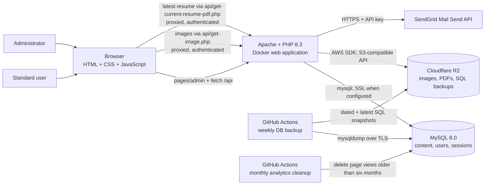
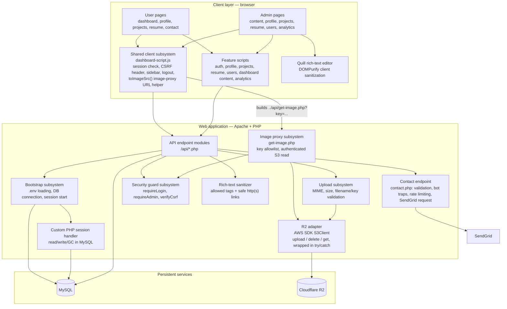
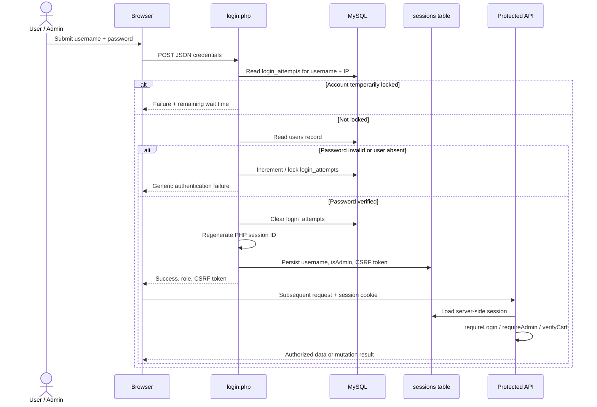
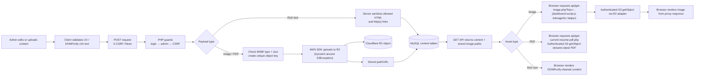
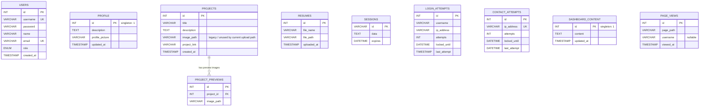
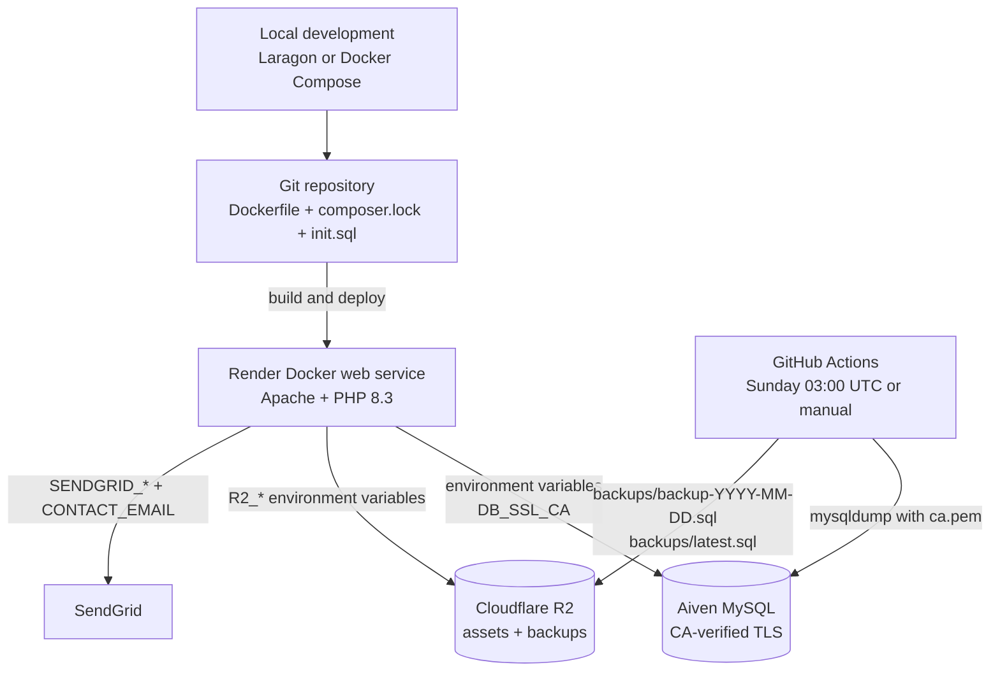
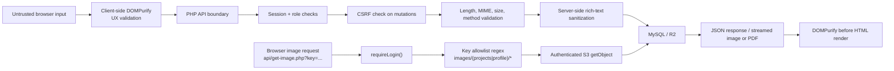

# System Architecture — Portfolio CMS

> A visual, implementation-based map of the PHP portfolio and its CMS. This document describes the system as it exists in this repository.

## 1. System at a glance

The application is a server-rendered static-page frontend with JavaScript-driven API calls. PHP API endpoints enforce authentication and authorization where required, persist application data and sessions in MySQL, send contact-form email through SendGrid, and store uploaded binary assets in Cloudflare R2. Images and the latest resume PDF are served back to the browser through authenticated backend proxies rather than directly from an R2 public URL. The application itself is disposable: persistent state is kept outside the web container.

## 2. Application layers and subsystems

### Client/UI subsystem

- `pages/user/` is the standard-user experience: dashboard, profile, project gallery, resume viewer, and contact form.
- `pages/admin/` provides CMS pages: profile/project/resume uploads, user-role management, and editable dashboard content.
- The admin dashboard includes an analytics panel. `log-view.php` records valid page paths, visitor tokens (`visitor_id`), and the optional signed-in username in `page_views`; `get-analytics.php` is protected by admin and CSRF checks and supports filtering by preset days (7, 14, 30 days), single dates (hourly breakdown), or custom date ranges, returning filtered views, unique visitors, today's views/uniques, top pages, and time-series data. `manage-analytics.js` displays dual-line metrics with Chart.js.
- `assets/scripts/dashboard-script.js` is the cross-cutting browser module. It performs server-side session verification on page load, stores the current CSRF token in `localStorage`, loads the correct sidebar fragment, handles logout, and exposes `toImageSrc(path)` — a shared helper that converts a stored image path (legacy full R2 URL or bare key) into a proxied `../api/get-image.php?key=...` URL. Because this file loads on every page before feature scripts, `toImageSrc()` is available globally without duplication.
- Feature scripts (`manage-*.js`, `auth.js`, `contact.js`) use `fetch()` for JSON and multipart form requests. They also provide loading states, confirmation dialogs, sliders, and image modals. Project and profile rendering call `toImageSrc()` rather than constructing R2 URLs directly.
- Quill is used only when editing rich text. DOMPurify sanitizes rich text in the browser before submission, before it is restored into an editor, and before it is inserted into the DOM. PHP also strips disallowed tags and attributes before persisting rich text, rebuilding permitted links with safe `http(s)` destinations.

### API and application subsystem

- Every PHP API endpoint returns JSON and uses `bootstrap.php` directly or through `auth-check.php`.
- `db.php` loads environment variables with `phpdotenv` and creates a `mysqli` connection. If `DB_SSL_CA` is configured, it connects using the CA certificate and MySQL SSL.
- `session-db.php` replaces PHP's default file session storage with a database-backed handler. Session data expires after the configured PHP lifetime (currently 3,600 seconds).
- `auth-check.php` centralizes the three endpoint guards: authenticated session required, admin role required, and matching `X-CSRF-Token` required.
- `r2.php` hides Cloudflare R2 behind four helpers: create S3 client, upload object, extract a key from a public URL, and delete object. All calls into this adapter from endpoint code are wrapped in `try/catch` around `\Aws\S3\Exception\S3Exception`, so an R2-side failure (invalid/expired credentials, wrong bucket, network issue) returns a clean JSON error instead of an uncaught fatal error and an empty HTTP response body.
- `get-image.php` is a read-side proxy: it validates the requested `key` against an allowlist pattern (`images/projects/...` or `images/profile/...`), requires an authenticated session (`requireLogin()`), then performs an authenticated `getObject` call via the R2 adapter and streams the bytes back with the object's content type and a one-day cache header. This replaces direct browser requests to the R2 public development URL (`pub-*.r2.dev`), which is not intended for production traffic and is subject to undocumented rate limits.
- `get-current-resume-pdf.php` is the corresponding resume proxy: it requires an authenticated session, selects the most recently uploaded resume, validates its `resumes/*.pdf` R2 key, and streams the PDF with a private one-hour cache header.
- `contact.php` accepts JSON `POST` requests, validates required fields and email format, caps the message at 5,000 characters, and silently accepts submissions that fill its honeypot field or arrive within two seconds of the form being loaded. It records attempts by client IP in `contact_attempts`; after the third attempt, further requests from that IP are rejected for 60 minutes. Valid messages are sent through SendGrid's Mail Send API using `SENDGRID_API_KEY`; `SENDGRID_FROM_EMAIL` is the sender and `CONTACT_EMAIL` receives the message. The visitor's email is used only as the email reply-to address.

## 3. Authentication and authorization flow

**Authorization rules**

| Capability | Who can use it | Server-side protection |
| --- | --- | --- |
| Sign up and log in | Unauthenticated visitor | Input validation; bcrypt-compatible `password_hash`/`password_verify`; login-attempt throttling |
| View dashboard, profile, projects, and resumes | Authenticated user or admin | `requireLogin()` |
| Load a profile or project image | Authenticated user or admin | `requireLogin()` + key allowlist (`get-image.php`) |
| Edit dashboard content | Admin | `requireAdmin()` + CSRF |
| Upload profile, projects, and resumes | Admin | `requireAdmin()` + CSRF |
| Update project details | Admin | `requireAdmin()` + CSRF |
| Delete a project | Admin | `requireAdmin()` + CSRF |
| List users / change roles | Admin | `requireAdmin()` + CSRF |
| Log out | Authenticated session with valid token | CSRF token validation then session-cookie and server-session destruction |
| Submit contact form | Any caller of the endpoint | POST-only JSON, required-field/email/message-length validation, honeypot and timing traps, plus per-IP rate limiting; SendGrid credentials remain server-side |

The browser's `localStorage` values are used for initial UI routing and carrying the CSRF token, but the API makes the final access decision from the server-side session stored in MySQL.

## 4. Content and upload flows

Upload limits enforced by the server:

| Asset | Accepted type | Maximum size | R2 key prefix | Database record |
| --- | --- | ---: | --- | --- |
| Profile image | JPEG, PNG, WebP | 2 MB | `images/profile/` | `profile.profile_picture` |
| Project image | JPEG, PNG, WebP, GIF | 5 MB each | `images/projects/` | `project_previews.image_path` |
| Resume | PDF | 5 MB | `resumes/` | `resumes.file_path` |

Deleting or updating a project removes/replaces its preview rows and attempts to delete each matching R2 object; delete failures are caught and logged rather than aborting the request, so database cleanup still completes even if an R2 object can't be removed. It also contains a legacy local-upload fallback that only permits deletion inside `assets/uploads`.

## 5. API map

| Endpoint | Purpose | Access | Persistence / integration |
| --- | --- | --- | --- |
| `signup.php` | Create a standard-user account | Public | `users` |
| `login.php` | Authenticate, establish session, issue CSRF token | Public | `users`, `login_attempts`, `sessions` |
| `logout.php` | Destroy current session | Authenticated + CSRF | `sessions` |
| `check-session.php` | Return login/role state and current CSRF token | Session-aware | `sessions` |
| `get-profile.php` | Read profile content | Logged in | `profile` |
| `upload-profile.php` | Save profile text and optional image | Admin + CSRF | `profile`, R2 |
| `get-projects.php` | Read projects with preview images | Logged in | `projects`, `project_previews` |
| `upload-projects.php` | Create project and upload images | Admin + CSRF | `projects`, `project_previews`, R2 |
| `update-project.php` | Update an existing project and replace preview images | Admin + CSRF | `projects`, `project_previews`, R2 |
| `delete-project.php` | Delete project and associated images | Admin + CSRF | `projects`, `project_previews`, R2 |
| `get-image.php` | Stream a profile or project image via authenticated R2 read | Logged in | R2 (read-only) |
| `get-current-resume-pdf.php` | Stream the latest resume PDF via authenticated R2 read | Logged in | `resumes`, R2 (read-only) |
| `get-resumes.php` | Read uploaded resume metadata | Logged in | `resumes` |
| `upload-resume.php` | Upload resume PDF | Admin + CSRF | `resumes`, R2 |
| `dashboard-content.php` | Read/update dashboard About content | Read: logged in; write: admin + CSRF | `dashboard_content` |
| `users-table.php` | List accounts | Admin + CSRF | `users` |
| `set-role.php` | Change a user role | Admin + CSRF | `users` |
| `log-view.php` | Record a valid page view and the optional signed-in username | Public | `page_views` |
| `get-analytics.php` | Return aggregate, top-page, and daily page-view data | Admin + CSRF | `page_views` |
| `contact.php` | Validate, throttle, and send a contact-form email | Public endpoint | `contact_attempts`, SendGrid Mail Send API |

## 6. Database model

`profile` and `dashboard_content` are singleton tables: the application writes and reads row `id = 1`. Sessions are deliberately database records rather than application-container files, allowing a session to survive a container replacement as long as the database remains available. `page_views` is created on demand by the analytics endpoints and is pruned monthly by `.github/workflows/analytics-cleanup.yml`, which retains six months of data. `profile.profile_picture` and `project_previews.image_path` may still contain legacy full R2 public URLs from before the image proxy was introduced; `toImageSrc()` on the client extracts the object key from either a full URL or a bare key before building the proxy request, so no data migration was required.

## 7. Deployment, configuration, and recovery

- **Local Docker:** `docker-compose.yml` starts the app container and a MySQL 8.0 service with `DB_HOST=db`, `DB_USER=appuser`, `DB_PASS=apppassword`, and `DB_NAME=fprojectdb_mysql`. The app source is mounted into `/var/www/html`, `init.sql` seeds the schema at container startup, and MySQL data is persisted in the `db_data` volume.
- **Production:** the Dockerfile builds an Apache + PHP 8.3 web service, installs required PHP extensions and Composer dependencies, enables URL rewriting, and serves the repository content as the application. Render hosts the built container, while MySQL and Cloudflare R2 remain independent managed services.
- **Configuration:** PHP loads environment values via `phpdotenv` in local development, while production and CI inject credentials through environment variables. Database SSL is enabled when `DB_SSL_CA` is provided for CA-verified connections. `R2_ACCESS_KEY_ID`/`R2_SECRET_ACCESS_KEY` must stay in sync with the currently active Cloudflare R2 API token — deleting and recreating a token invalidates these values until Render's environment variables are updated and the service is redeployed. Contact email requires `SENDGRID_API_KEY`, `SENDGRID_FROM_EMAIL` (a SendGrid-verified sender), and `CONTACT_EMAIL` (the receiving inbox).
- **Recovery subsystem:** `.github/workflows/db-backup.yml` runs `mysqldump` against Aiven using the committed `ca.pem` certificate, then uploads both a dated SQL snapshot and `latest.sql` to Cloudflare R2 via the AWS CLI. The workflow runs weekly and can also be triggered manually.
- **Analytics retention:** `.github/workflows/analytics-cleanup.yml` runs monthly (or manually) against the production database over TLS and deletes `page_views` records older than six months.

## 8. Security boundaries and controls

Key controls include password hashing, session-ID regeneration after successful login, `HttpOnly`/`SameSite=Lax` session cookies, CSRF tokens on state-changing actions verified with a timing-safe comparison, login throttling (five attempts, 15-minute lock), prepared SQL statements for user-controlled query values, MIME/size checks for uploads, server-side rich-text tag/attribute and link sanitization, optional CA-verified encrypted database connections, contact-form POST/field validation, honeypot and timing traps, and per-IP throttling (three attempts followed by a 60-minute lock) with the SendGrid key retained server-side, and — for image and resume delivery — session-gated, key-allowlisted proxying of R2 reads rather than exposing the bucket via an unauthenticated public URL.

## 9. Important operational dependencies

| Dependency | Why it matters |
| --- | --- |
| MySQL availability | Authentication, sessions, all CMS data, and dashboard page protection depend on it. |
| R2 availability | New uploads, project deletion/update, and **all image and resume viewing** depend on the R2 API, since both asset types are served through authenticated proxies rather than a public URL. |
| Render application availability | Because images and resume PDFs are proxied through PHP endpoints, their delivery depends on the application being reachable, not solely on R2/Cloudflare's edge. |
| Correct environment variables | Required for DB connection, R2 client credentials, R2 bucket/public URL, and optional SSL CA path. |
| SendGrid credentials | `SENDGRID_API_KEY`, a verified `SENDGRID_FROM_EMAIL`, and `CONTACT_EMAIL` are required for contact-form delivery. |
| AWS CLI in CI | GitHub Actions uses the AWS CLI to upload backup artifacts to Cloudflare R2. |
| CDN-hosted Quill, DOMPurify, and Chart.js | Editing pages and safe rich-text rendering load Quill and DOMPurify from cdnjs; the admin analytics chart loads Chart.js from cdnjs. |
| GitHub Actions secrets and `ca.pem` | Required for scheduled production database backups. |
