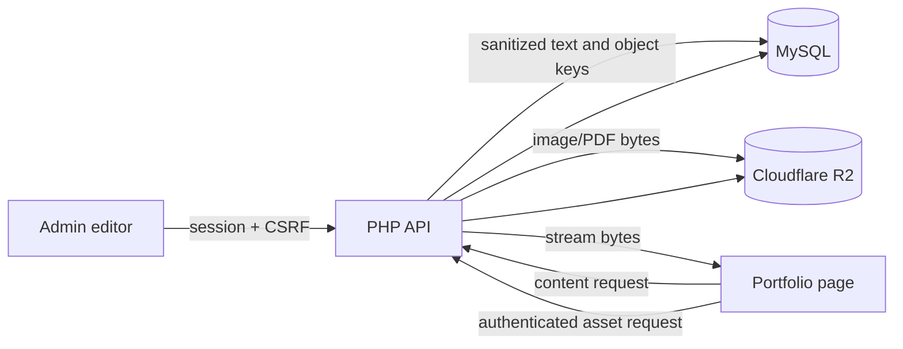

# Features

The site has a public portfolio/contact experience and a signed-in area for users and administrators. Pages are HTML; JavaScript calls PHP endpoints; MySQL stores application data and Cloudflare R2 stores uploaded files.

## Feature map

| Feature | User | Admin | How it works |
| --- | --- | --- | --- |
| Account access | Sign up, sign in, sign out | Same | PHP verifies password hashes, stores sessions in MySQL, and issues a CSRF token. Login attempts are throttled per username and IP. |
| Portfolio | View profile, social links, projects and resume | Edit profile and social links; manage projects and resume | Read APIs return database records. Upload APIs store files in R2 and save their keys in MySQL. Image and latest-resume requests are streamed through authenticated PHP proxies. |
| Dashboard About | View content | Edit rich-text content | Content is sanitized in the browser and again on the server before MySQL storage. |
| User management | — | List accounts and change roles | Admin-only endpoints check the server session, admin role, and CSRF token. |
| Analytics | Page views are recorded during visits | View totals and filtered charts | The browser sends page paths and a persistent visitor ID. Admin charts query `page_views` by date/range; older records are periodically pruned. |
| Contact | Send a message | Receive it by email | The endpoint validates fields and sends through SendGrid. Honeypot/timing traps and per-IP throttling limit abuse. |
| Portfolio PDF | Download a generated portfolio | — | A public endpoint combines current profile/project data and available R2 images into a PDF; downloads are throttled per IP. |

## Content and asset flow

## Access rules

- Portfolio data and protected asset reads require a signed-in session.
- Content changes, uploads, project deletion, analytics reads, and role changes require an admin session and `X-CSRF-Token`.
- Signup, login, contact submission, page-view logging, and portfolio PDF export are public endpoints. Public endpoints validate inputs and apply rate limits where implemented.
- The browser may use local storage to retain UI state and the CSRF token, but the API authorizes from the server-side session.

See [System architecture](SYSTEM_ARCHITECTURE.md) for the component, authentication, storage, and database diagrams.
