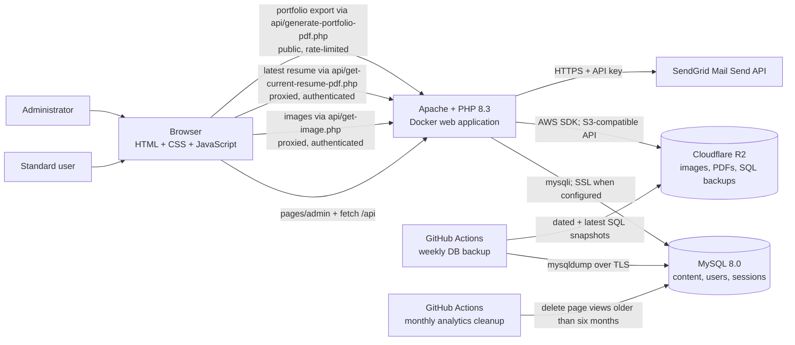
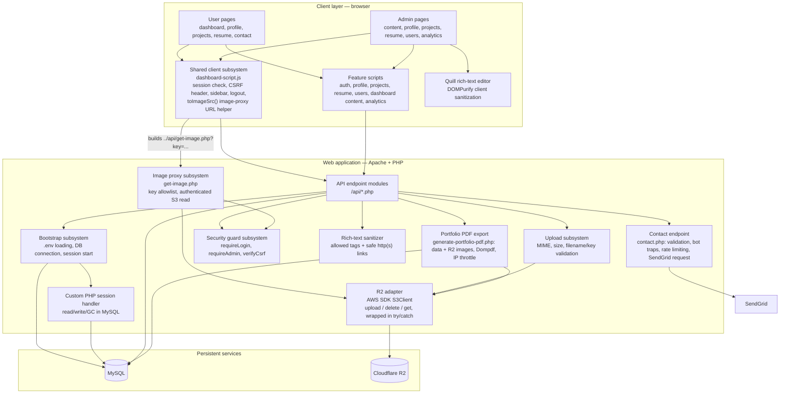
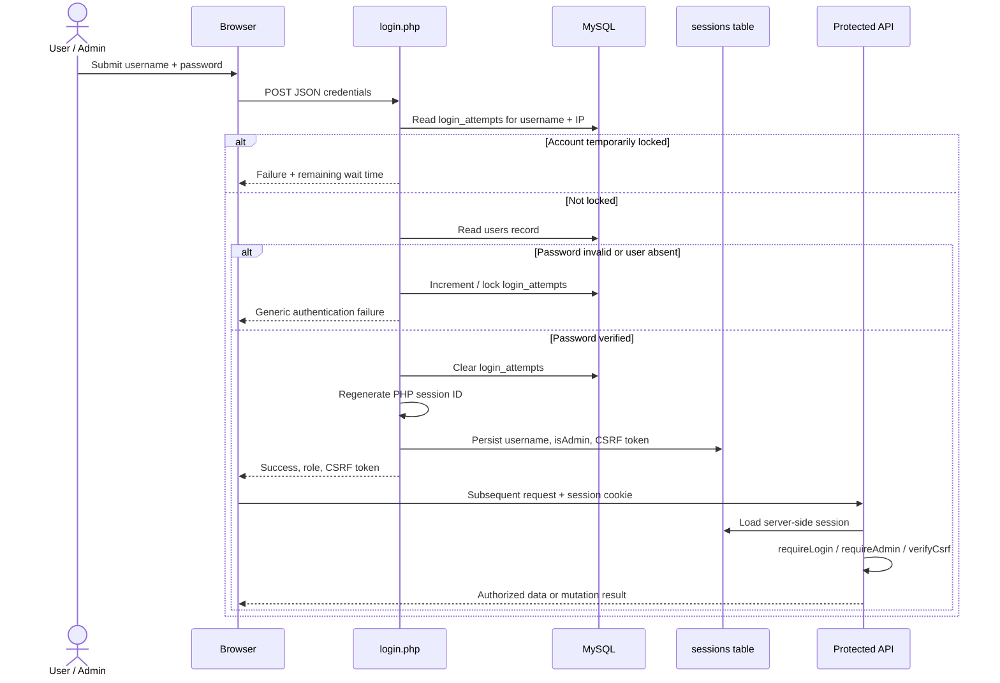
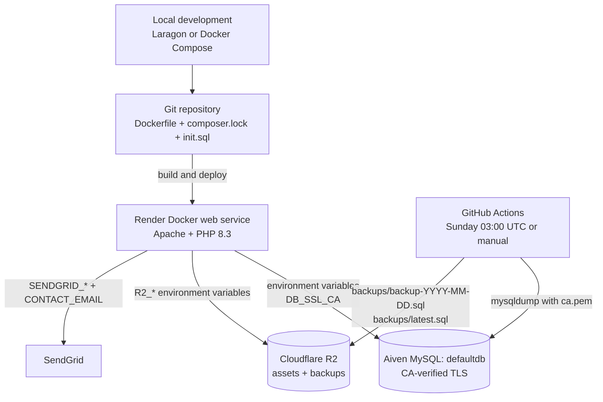
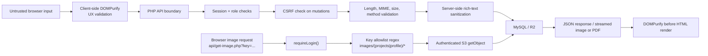

# System Architecture — Portfolio CMS

> A visual, implementation-based map of the PHP portfolio and its CMS. This document describes the system as it exists in this repository.

## 1. System at a glance

The application serves HTML pages with JavaScript-driven API calls. PHP endpoints enforce authentication and authorization where required, persist application data and sessions in MySQL, send contact-form email through SendGrid, and store uploaded binary assets in Cloudflare R2. Images and the latest resume PDF are served through authenticated backend proxies. A separate public endpoint generates a portfolio PDF from current database content and available R2 images. The application itself is disposable: persistent state is kept outside the web container.

## 2. Application layers and subsystems

### Client/UI subsystem

`pages/user/` contains the signed-in portfolio experience; `pages/admin/` contains CMS tools for content, projects, resumes, users, and analytics. `dashboard-script.js` checks the server session, loads shared navigation, handles logout, and maps stored image paths to authenticated image-proxy URLs. Feature scripts call PHP endpoints with JSON or multipart requests. Rich text is sanitized in the browser and server-side; analytics records page paths and visitor IDs for admin reporting.

### API and application subsystem

- JSON endpoints load the shared database and session bootstrap; image, resume, and portfolio-PDF routes stream binary responses.
- PHP uses `mysqli`; when `DB_SSL_CA` is configured, the connection uses MySQL TLS. PHP sessions are stored in MySQL and expire with the configured session lifetime.
- `auth-check.php` provides session, administrator-role, and CSRF guards. Route-specific access and inputs are listed in the [API endpoint reference](API_ENDPOINTS.md).
- The R2 adapter supports object upload, read, key extraction, and deletion. Authenticated image and resume proxies validate object keys before streaming files.
- The contact endpoint validates submissions and sends email through SendGrid. Public portfolio PDF export reads current database content and R2 images, then renders with Dompdf. Both public flows use IP-based rate limits.

## 3. Authentication and authorization flow

The server authorizes protected routes using the MySQL-backed session and role; admin mutations also require a valid CSRF token. Browser local storage supports UI routing and carries the CSRF token, but does not grant API access. See the [API endpoint reference](API_ENDPOINTS.md) for route-level access rules.

## 4. Content and upload flows

```mermaid
flowchart LR
    A["Admin edits or uploads content"] --> B["Client validates UX / DOMPurify rich text"]
    B --> C["POST request\nX-CSRF-Token"]
    C --> D["PHP guards\nlogin → admin → CSRF"]
    D --> E{"Payload type"}
    E -->|"Rich text"| F["Server sanitizes allowed HTML\nand http(s) links"]
    E -->|"Image / PDF"| G["Check MIME type + size\ncreate unique object key"]
    F --> H[("MySQL content tables")]
    G --> I["AWS SDK uploads to R2\n(try/catch around S3Exception)"]
    I --> J[("Cloudflare R2 object")]
    I --> K["Stored path/URL"]
    K --> H
    H --> L["GET API returns content + stored image paths"]
    L --> M{"Asset type"}
    M -->|"Image"| N["Browser requests api/get-image.php?key=...\n(dashboard-script.js toImageSrc helper)"]
    N --> O["Authenticated S3 getObject via R2 adapter"]
    O --> P["Browser renders image from proxy response"]
    M -->|"PDF"| Q["Browser requests api/get-current-resume-pdf.php\nAuthenticated S3 getObject streams latest PDF"]
    M -->|"Rich text"| R["Browser renders DOMPurify-cleaned content"]
    V["Visitor requests portfolio PDF"] --> S["Public portfolio PDF endpoint"]
    S --> T["Read current profile/projects + fetch R2 images"]
    T --> U["Dompdf renders and streams PDF"]
```

Upload limits enforced by the server:

| Asset | Accepted type | Maximum size | R2 key prefix | Database record |
| --- | --- | ---: | --- | --- |
| Profile image | JPEG, PNG, WebP | 2 MB | `images/profile/` | `profile.profile_picture` |
| Project image | JPEG, PNG, WebP, GIF | 5 MB each | `images/projects/` | `project_previews.image_path` |
| Resume | PDF | 5 MB | `resumes/` | `resumes.file_path` |

Deleting or updating a project removes/replaces its preview rows and attempts to delete each matching R2 object; delete failures are caught and logged rather than aborting the request, so database cleanup still completes even if an R2 object can't be removed. It also contains a legacy local-upload fallback that only permits deletion inside `assets/uploads`.

## 5. API reference

Route purposes, request fields, and access requirements are maintained in the [API endpoint reference](API_ENDPOINTS.md) to avoid duplicating the route table here.
## 6. Database model

```mermaid
erDiagram
    USERS {
        INT id PK
        VARCHAR username UK
        VARCHAR password
        VARCHAR name
        VARCHAR email UK
        ENUM role
        TIMESTAMP created_at
    }
    PROFILE {
        INT id PK "singleton: 1"
        TEXT description
        VARCHAR profile_picture
        TIMESTAMP updated_at
    }
    PROJECTS {
        INT id PK
        VARCHAR title
        TEXT description
        VARCHAR image_path "legacy / unused by current upload path"
        VARCHAR project_link
        TIMESTAMP created_at
    }
    PROJECT_PREVIEWS {
        INT id PK
        INT project_id FK
        VARCHAR image_path
    }
    RESUMES {
        INT id PK
        VARCHAR file_name
        VARCHAR file_path
        TIMESTAMP uploaded_at
    }
    SESSIONS {
        VARCHAR id PK
        TEXT data
        DATETIME expires
    }
    LOGIN_ATTEMPTS {
        INT id PK
        VARCHAR username
        VARCHAR ip_address
        INT attempts
        DATETIME locked_until
        TIMESTAMP last_attempt
    }
    CONTACT_ATTEMPTS {
        INT id PK
        VARCHAR ip_address UK
        INT attempts
        DATETIME locked_until
        DATETIME last_attempt
    }
    PDF_ATTEMPTS {
        INT id PK
        VARCHAR ip_address UK
        INT attempts
        DATETIME locked_until
        DATETIME last_attempt
    }
    DASHBOARD_CONTENT {
        INT id PK "singleton: 1"
        TEXT content
        TIMESTAMP updated_at
    }
    PAGE_VIEWS {
        INT id PK
        VARCHAR page_path
        VARCHAR username "nullable"
        VARCHAR visitor_id "nullable"
        TIMESTAMP viewed_at
    }

    PROJECTS ||--o{ PROJECT_PREVIEWS : "has preview images"
```

`profile` and `dashboard_content` are singleton tables: the application writes and reads row `id = 1`. Sessions are deliberately database records rather than application-container files, allowing a session to survive a container replacement as long as the database remains available. `page_views` is created on demand by the analytics endpoints and is pruned monthly by `.github/workflows/analytics-cleanup.yml`, which retains six months of data. `profile.profile_picture` and `project_previews.image_path` may still contain legacy full R2 public URLs from before the image proxy was introduced; `toImageSrc()` on the client extracts the object key from either a full URL or a bare key before building the proxy request, so no data migration was required.

## 7. Deployment, configuration, and recovery

- **Local Docker:** `docker-compose.yml` starts the app and MySQL 8.0 with fixed local credentials and `DB_NAME=fprojectdb_mysql`. It mounts the source into `/var/www/html`, initializes the schema from `init.sql` on a new volume, and persists database files in `db_data`. Compose database values are configured in the Compose file; optional R2 and SendGrid values can be loaded by PHP from the root `.env`.
- **Production:** the Dockerfile builds an Apache + PHP 8.3 web service, installs required PHP extensions and Composer dependencies, enables URL rewriting, and serves the repository content as the application. Render hosts the built container, while MySQL and Cloudflare R2 remain independent managed services.
- **Configuration:** The production app `DB_NAME` must match the database targeted by the GitHub Actions workflows, currently `defaultdb`. Database SSL uses `DB_SSL_CA`. Keep R2 credentials synchronized with the active Cloudflare token. Contact delivery uses `SENDGRID_API_KEY`, verified `SENDGRID_FROM_EMAIL`, and recipient `CONTACT_EMAIL`.
- **Recovery subsystem:** `.github/workflows/db-backup.yml` dumps `defaultdb` over TLS using `ca.pem`, then uploads a dated SQL snapshot and `latest.sql` to Cloudflare R2. It runs weekly and can be triggered manually.
- **Analytics retention:** `.github/workflows/analytics-cleanup.yml` runs monthly (or manually) against the production database over TLS and deletes `page_views` records older than six months.

## 8. Security boundaries and controls

Key controls include password hashing, session-ID regeneration after successful login, `HttpOnly`/`SameSite=Lax` session cookies, CSRF tokens on state-changing actions verified with a timing-safe comparison, login throttling (five attempts, 15-minute lock), prepared SQL statements for user-controlled query values, MIME/size checks for uploads, server-side rich-text tag/attribute and link sanitization, optional CA-verified encrypted database connections, contact-form validation and abuse throttling, and session-gated, key-allowlisted proxying for image and resume reads. The public portfolio PDF endpoint also has per-IP throttling; contact and PDF rate limits are separate.

## 9. Important operational dependencies

| Dependency | Why it matters |
| --- | --- |
| MySQL availability | Authentication, sessions, all CMS data, and dashboard page protection depend on it. |
| R2 availability | New uploads, project deletion/update, and **all image and resume viewing** depend on the R2 API, since both asset types are served through authenticated proxies rather than a public URL. |
| Render application availability | Because images and resume PDFs are proxied through PHP endpoints, their delivery depends on the application being reachable, not solely on R2/Cloudflare's edge. |
| Correct environment variables | Required for DB connection, R2 client credentials, R2 bucket/public URL, and optional SSL CA path. |
| SendGrid credentials | `SENDGRID_API_KEY`, a verified `SENDGRID_FROM_EMAIL`, and `CONTACT_EMAIL` are required for contact-form delivery. |
| AWS CLI in CI | GitHub Actions uses the AWS CLI to upload backup artifacts to Cloudflare R2. |
| CDN-hosted Quill, DOMPurify, and Chart.js | Editing pages and safe rich-text rendering load Quill and DOMPurify from cdnjs; the admin analytics chart loads Chart.js from cdnjs. |
| GitHub Actions secrets and `ca.pem` | Required for scheduled production database backups. |
